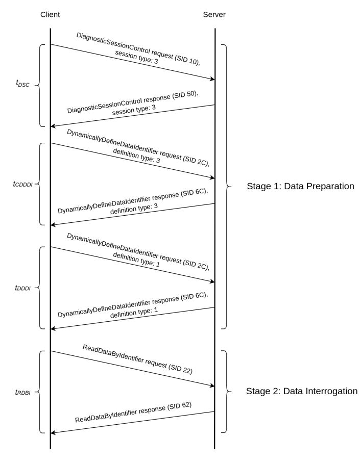
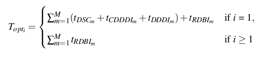

AUTHOR: DAVID TENA GAGO

**NOTE**: Due to Intellectual Property Right concerns, some parts of the code of this repo has been modified, including:
- The attributes "address", "PID" and "scalar" of the object of type "ImportantParameters", in file ``lib/parameters.py``
- The deletion of logs in ``logs/``, just leaving a sample of what the logs look like per each sub directory


This project gathers different tools for interfacing with the vehicle's CAN bus for collecting real-time metrics through the use of [Panda](https://www.comma.ai/shop/panda) and UDS/OBD protocol messaging. The project is structured as follows:

- **debug**: contains scripts for helping debugging the CAN traffic:
   - can_printer: displays the incoming and outgoing messages captured by Panda. Can be configured to filter by ECU ID.
   - measure_throughput_co2: measures the elapsed time taken to send a fixed number of messages to measure the bandwidth.
   - plot_co2_request: plots real-time CO2 concentration measurements reported by the CO2 sensor through UDS requests/responses. Can be configured so the concentration is expressed in PPM or %.
   - plot_co2_unsolicited: same as above, but only works when the CO2-agent has been programmed to continuously send gratuitous CO2 concentration messages.
   - replay_plot: plots a data-series of previously recorded CO2 values stored in a .CSV file. The preferred way to generate this .CSV file is by using the script ``co2_collector.py``.
   - send_can: serves to send ad-hoc messages through the CAN bus. Avoid using it unless you're certain about what you are doing to prevent errors in vehicle's ECUs.
- **grafanaVisualising**: contains all the necessary files to collect and store the defined parameters and display them in a browser via Grafana. Uses a previously defined MySQL database and comes in very handy for logging & exporting real-time footage while plotting the metrics.
- **lib**:
  - protocols: contains a set of different libraries for parsing and treating messages across different protocols in the OSI stack:
    - Link layer: CAN
    - Transport layer: ISO-TP
    - Application layer: UDS, OBD
  - clients: implements high-level methods for interacting with low-level messaging protocols libraries described above.
  - ``gps_collector.py``: gathers the information provided by the [GPS-agent](https://github.com/flacomalone/gps_tracker_fipy). Can also log results.
  - ``co2_collector.py``: gathers the information provided by the [CO2-agent] (More information about this component can be found [here](https://www.sciencedirect.com/science/article/pii/S2542660523000781)). Can also log results.
  - ``realtime.py``: ensures a constant defined frequency is achieved in loop executions.
  - ``parameters.py``: contains the definitions of ALL the available reverse-engineered parameters from Techstream as well as any other available parameter that can be queried via OBD or UDS. This file also defines the data parsing and scaling of each parameter. The parameters are gathered in a dictionary called "parameters" used by other scripts to ease the querying tasks.
- **logs**: keeps a record of the footage collected in .CSV format. It contains the following subdirectories:
  - co2: ONLY CO2 measurements. Used by ``co2_collector.py``.
  - gps: ONLY GPS measurements. Used by ``lib/gps_collector.py``.
  - RDE (Real Driving Emissions): contains footage of different collected parameters defined in ``paramters.py``. Each log file is named after the starting logging date in the format ``mm-dd-YYYY--HH-MM-SS``.
- **media**: material used for ``README.md`` files.
- **panda**: submodule of the repository [panda](https://github.com/commaai/panda).
- ``RDE.py``: this scrip defines and logs a set of real-time vehicle parameters from ``parameters.py``. It is basically the same as the grafana visualiser but without the visualisation and database creation. The results are saved in logs/RDE in a .CSV format containing all the previously defined parameters.

## Optimised data querying

In order to speed up the process of data UDS querying, an alternative approach also in compliance with the official protocol definition has been considered to avoid the sequential execution shown above.
Instead of querying the parameters one by one, a dynamically defined data identifier is created per interrogated ECU in such a way that this data identifier includes several parameters previously defined as a compound response.



Thus, first the dynamically defined data identification is performed in Stage 1: Data Preparation just once prior to any data querying.
In this stage, first the diagnostic session is extended to allow the creation and deletion of dynamically defined data identifiers with service DiagnosticSessionControl (SIDs 2C and 6C for the request and response message, respectively).
Later on, service DynamicallyDefineDataIdentifier is requested with the intention of clearing (definition type 3) a previously dynamically defined data identifier which might still be defined from previous CAN Sniffer executions in order to avoid a system misconfiguration.
Lastly, the same service is requested again to dynamically define a new data identifier (definition type 1). The payload of this request includes the new data identifier as well as the list of the parameters to be queried under this new data identifier. 

Subsequently, Stage 2: Data Interrogation begins to perform just one query by means of the service ReadDataByIdentifier with the previously defined data identifier per each ECU to interrogate.
As a result, the *i<sup>th</sup>* time cost of the optimised querying method, *T<sub>opt<sub>i</sub></sub>* is defined by the equation below.



Where, *t<sub>DSC</sub>* is the time taken to extend the diagnostic session, *t<sub>CDDDI</sub>* is the time taken to clear any previously defined data identifier, *t<sub>DDDI</sub>* is the time taken to dynamically define a new data identifier, *t<sub>RDBI</sub>* is the time taken to perform a data acquisition, and *M* is the total number of different ECUs to interrogate.
This alternative optimised method relies on the number of ECUs in use and not in the number of parameters to request, allowing a faster and more efficient usage of the CAN bus.

In order to do this in the code, you can use the UDS client in this repo. Therefore, in order to query multiple params **FROM THE SAME ECU ADDRESS** you have to do the following (in order):
 1. extend the current diagnostic session (see ``create_extendedDiagnosticSession`` in ``UDS_client.py``)
 2. Clear previously defined dynamic identifier (see ``clearPreviousDynamicallyDefinedDataIdentifier`` in ``UDS_client.py``)
 3. Create a new dynamically defined identifier for the set of parameters chosen (see ``createDynamicallyDefinedDataIdentifierByParameterId`` in ``UDS_client.py``)

Once this is done, you can request multiple parameters with service ID 22 with the defined data identifier for multiple queries (see ``readDataByIdentifier_dynamicallyAllocated`` in ``UDS_client.py``).

**Remember that a UDS client must be created per ECU that is being queried.**

For instance:
```python
from panda.python import Panda
from lib.protocols.UDS import UdsClient
import lib.clients.UDS_client as UDS
from lib.parameters import parameters as P

# Prepare environment
panda = Panda()
panda.set_safety_mode(Panda.SAFETY_ALLOUTPUT)

UDS_client_0x7D2 = UdsClient(panda, 0x7D2, 0, timeout=1, debug=False)
UDS_client_0x700 = UdsClient(panda, 0x700, 0, timeout=1, debug=False)

parametersToQuery_0x700 = [  # Engine
    P["coolant_temperature"],
    P["vehicle_fuel_rate"],
]

parametersToQuery_0x7D2 = [  # Hybrid System
    P["deceleration_sensor"],
    P["engine_speed"],
]

UDS.prepareDynamicallyDefinedData(UDS_client_0x7D2, parametersToQuery_0x7D2)
UDS.prepareDynamicallyDefinedData(UDS_client_0x700, parametersToQuery_0x700)

# Now you're ready to query
while True:
    print(UDS.readDataByIdentifier_dynamicallyAllocated(uds_client=UDS_client_0x7D2, parameter_list=parametersToQuery_0x7D2))
    print(UDS.readDataByIdentifier_dynamicallyAllocated(uds_client=UDS_client_0x700, parameter_list=parametersToQuery_0x700))
```
