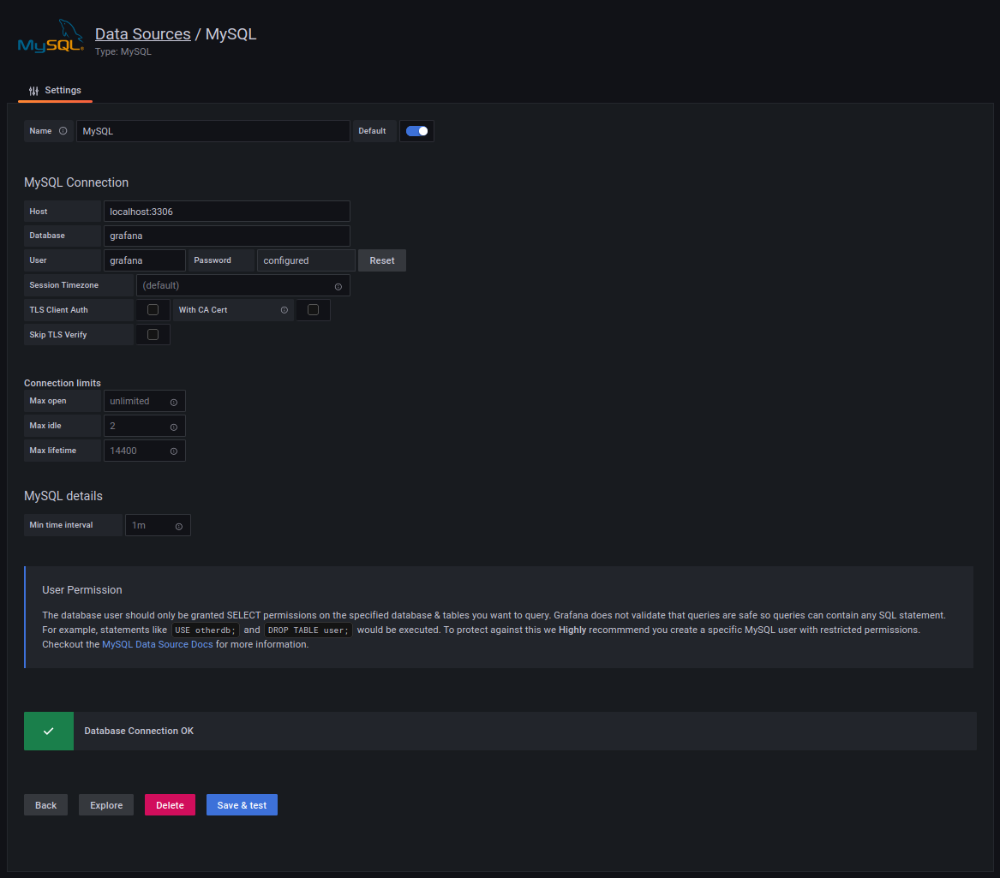
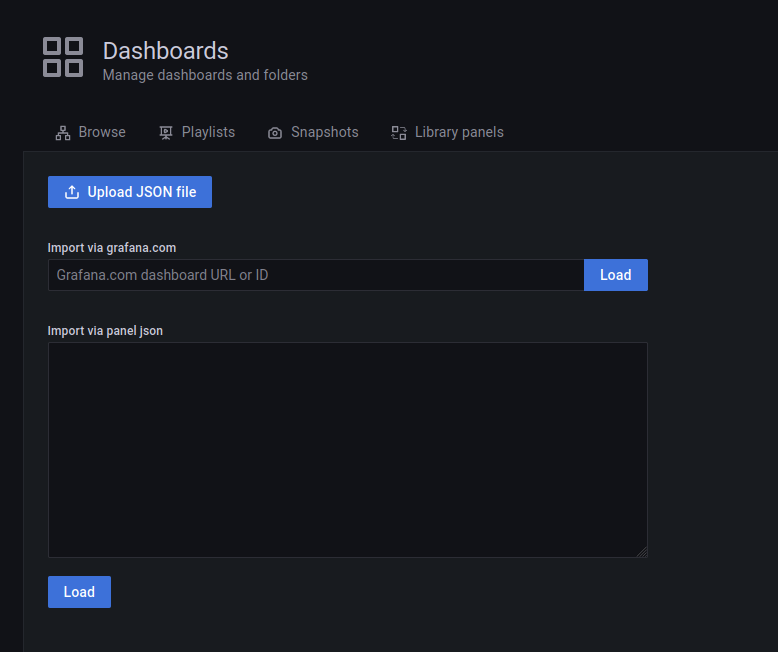
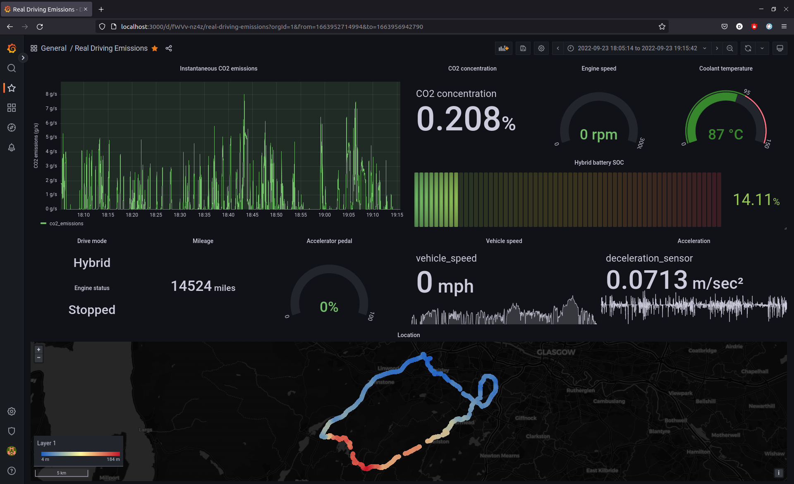

# Grafana installation
Grafana v10.1.2 (8e428858dd) is known to work for this code

```bash
sudo apt-get install -y apt-transport-https
sudo apt-get install -y software-properties-common wget
wget -q -O - https://packages.grafana.com/gpg.key | sudo apt-key add -

echo "deb https://packages.grafana.com/oss/deb stable main" | sudo tee -a /etc/apt/sources.list.d/grafana.list

sudo apt-get update
sudo apt-get install grafana

# Start the service
sudo systemctl daemon-reload
sudo systemctl start grafana-server

# (Optional) Configure Grafana to start at boot
sudo systemctl enable grafana-server.service
```

Now you can access Grafana in [localhost:3000](http://localhost:3000/). Default credentials are ``admin`` for both user and password.

## Recommended configurations
To allow Grafana to have a faster refresh rate in the dashboards, include this in ``/etc/grafana/grafana.ini``.
```bash
# In [dashboards] section:
min_refresh_interval = 100ms # Or whatever other time interval
```
Restart the service to apply changes
```bash
sudo systemctl restart grafana-server.service
```
Remember to include the time intervals you want later in the dashboard configuration panel.

# MySQL installation

```bash
sudo apt install mysql-server
sudo systemctl start mysql.service

# Change root password
sudo mysql
mysql> ALTER USER 'root'@'localhost' IDENTIFIED WITH mysql_native_password BY 'password';
mysql> exit

mysql -u root -p
mysql> ALTER USER 'root'@'localhost' IDENTIFIED WITH auth_socket;
mysql> exit

sudo mysql_secure_installation
```
## Create and configure database
Create a new database and a user to interact with Grafana.
```bash
mysql> CREATE DATABASE grafana;
mysql> USE grafana

mysql> CREATE USER "grafana" IDENTIFIED BY 'password';
mysql> GRANT SELECT ON grafana.* TO 'grafana'; # Grant only SELECT permissions
mysql> FLUSH PRIVILEGES;
```

The database is composed of as many tables as parameters have been configured to be collected, and one additional table (``timestamp_samples``) that records the timestamps per each set of parameter reads.
All the tuples of all the parameter tables have a foreign key pointing to the reference tuple id of the timestamp when that metric was collected.

So, the definition of the table ``timestamp_samples`` is the following:
```mysql
CREATE TABLE timestamp_samples (
    rowID INT NOT NULL AUTO_INCREMENT,
    timestamp DECIMAL(20,10) NOT NULL,
    PRIMARY KEY (rowID))
    ENGINE=InnoDB;
```

And the definition of every parameter table is the following:
```mysql
CREATE TABLE <parameterName>_samples (
    rowID INT NOT NULL AUTO_INCREMENT,
    timestampID INT NOT NULL,
    value DECIMAL (20,10),
    PRIMARY KEY (rowID),
    FOREIGN KEY (timestampID) REFERENCES timestamp_samples(rowId)
    ON UPDATE CASCADE
    ON DELETE CASCADE)
    ENGINE=InnoDB;
```

Optionally, the information about the location of the GPS-agent can also be recorded. The table definition looks as follows:
```mysql
CREATE TABLE location_samples (
    rowID INT NOT NULL AUTO_INCREMENT,
    timestampID INT NOT NULL,
    latitude DECIMAL (20,10),
    longitude DECIMAL (20,10),
    altitude DECIMAL (20,10),
    PRIMARY KEY (rowID),
    FOREIGN KEY (timestampID) REFERENCES timestamp_samples(rowId)
    ON UPDATE CASCADE
    ON DELETE CASCADE)
    ENGINE=InnoDB;
```

The database's tables structure is **automatically** defined, and will be based on the parameters selected to be inserted.
For instance, if the params chosen to be collected from the vehicle are ``vehicle_speed``, ``engine_speed`` and ``drive_mode``, the tables will be as follows:

```sql
mysql> show tables;
+-----------------------+
| Tables_in_grafana     |
+-----------------------+
| vehicle_speed_samples |
| engine_speed_samples  |
| drive_mode_samples    |
+-----------------------+
```

Then, for every parameter table, the records will look like this:
```sql
mysql> desc vehicle_speed_samples;
+-------+---------------+--------------+
| rowID | timestampID   | value        |
+-------+---------------+--------------+
| 1     | 1             | XXXX         |
| 2     | 2             | XXXX         |
| 3     | 3             | XXXX         |
| 4     | 4             | XXXX         |
...

```

# Visualisation configuration

## Configure datasource
<br>
- Name: MySQL
- Host: localhost:3306
- Database: grafana
- User: grafana
- Password: WhatTheHell!

## Import dashboard
Create a new dashboard by importing or pasting the JSON structure saved in the repo. The JSON file is in ``./dashboard.json``.

<br>

# Usage
## Collect and display data
In the file ``./config_params.py``, select which parameters you want to include to be collected. This set of parameters will determine the definition of the table ``metric_samples`` in case you previously erase it. You may find errors if you attempt to run the collection with parameters that has not been defined before. However, since the definition of the table allows inserting NULL values in tuples, you won't have an error if you don't insert the value of an already defined parameter.

To start gathering metrics and display them in Grafana, run
```bash
python ./main.py #[options]
```
It is possible to add the following options:
 - ``--gps``: Defines and gather GPS latitude, longitude and altitude. Note that to use this option, you have to use the [GPS-agent](https://gitavcn.uws.ac.uk/dtena/gps-agent).
 - ``-d``, ``--deleteDB``: Delete table ``metric_samples`` and its tuples before starting gathering new data. It is useful when a new scenario is going to be recorded and want to separate from previous footage for easier exportation.
 - ``-od``, ``--overwriteDate``: Overwrites the date saved in ``./latest_connection_date.txt`` with the current date using format ``mm-dd-YYYY--HH-MM-SS``. Use this option if you want to export the data you will collect with the starting execution date.
 - ``-f``, ``--frequency``: Determines the collection frequency. Default is 5 Hz.

After that, the new recorded data should be visible in [Grafana](http://localhost:3000/).

<br>


## Export DB to CSV
To export the previously recorded values stored in the DB in .CSV format, execute
```bash
python ./exportDB.py # [-s start_date -f finish_date]
```
If you don't want to export the whole current status of the table, it is possible to specify the starting and finishing date of the recorded data you want to export. Use options ``-s`` and ``-f``, respectively, to indicate the time range.
```bash
# Example
python ./exportDB.py -s "06-24-2022--12-24-04" -f "06-24-2022--13:05:16"
```

The file will be saved in ``../../logs/RDE/<dd-mm-YYYY--HH-MM-SS>.csv``
